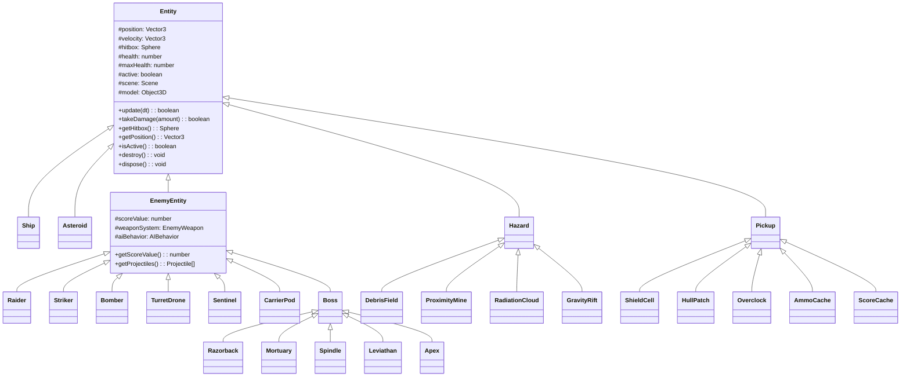

# Level Design Expansion Implementation

## Current State

- Only `Asteroid` and `Ship` exist in `src/entities/` (no shared base class)
- Spawning is timer-based in `Scene.ts` (`manageAsteroidSpawning`) -- no wave structure
- `WaveManager` exists but is never imported or called
- `ZoneConfig` only has asteroid parameters -- no enemy/hazard/pickup/boss fields
- No enemy entities, hazards, pickups, or bosses exist in code

## Architecture Overview



---

## Phase 1: Entity Foundation

**Goal:** Unify all game objects under a common abstract base class.

### 1a. Create `src/entities/Entity.ts`

Abstract base class with shared state and lifecycle:

```typescript
export abstract class Entity {
  protected position: THREE.Vector3;
  protected velocity: THREE.Vector3;
  protected hitbox: THREE.Sphere;
  protected model: THREE.Object3D | null = null;
  protected scene: THREE.Scene;
  protected active: boolean = true;
  protected health: number;
  protected maxHealth: number;

  abstract update(deltaTime: number): boolean; // returns active state

  takeDamage(amount: number): boolean {
    /* reduce health, return true if dead */
  }
  getHitbox(): THREE.Sphere {
    return this.hitbox;
  }
  getPosition(): THREE.Vector3 {
    return this.position.clone();
  }
  getPositionRef(): THREE.Vector3 {
    return this.position;
  }
  isActive(): boolean {
    return this.active;
  }
  destroy(): void {
    /* remove model from scene, set active=false */
  }
  dispose(): void {
    /* full cleanup: geometry, materials */
  }
}
```

Key design decisions:

- `update()` returns `boolean` (Asteroid's convention) -- simpler for filter-based removal
- `hitbox` standardized on `THREE.Sphere` (Ship currently uses `THREE.Mesh` for its hitbox but `Scene.ts` already wraps it in a `shipBoundingSphere` at line 1169, so the sphere approach is already the real collision primitive)
- `health`/`maxHealth` on base class -- asteroids get `health=1` (one-shot), enemies get real HP pools
- `takeDamage()` on base class replaces the current instant-destroy pattern for asteroids and allows enemies to have actual health

### 1b. Refactor `Asteroid` to extend `Entity`

- Move `position`, `velocity`, `hitbox`, `active`, `scene`, `model` to super
- `health = 1`, `maxHealth = 1` (maintains current one-shot behavior)
- `update()` already returns `boolean` -- matches base signature
- `handleCollision()` delegates to `takeDamage(health)` (instant kill) then `destroy()`
- `damage` property stays asteroid-specific (contact damage dealt to player)
- Keep `getSize()`, `getDamage()`, procedural model generation as-is

### 1c. Refactor `Ship` to extend `Entity`

- Move shared fields to super
- `update()` changes return type from `void` to `boolean` (always returns `true` since ship removal is handled separately via `handleShipDestruction`)
- Ship's `takeDamage()` overrides base to handle shield-first absorption and `damageReduction`
- Ship's `getHitbox()` overrides to return `this.hitbox` as `THREE.Sphere` (convert the existing `THREE.Mesh` box hitbox to a sphere, matching what `Scene.ts` already does with `shipBoundingSphere`)
- Keep all ship-specific systems (weapons, input, entry animation, boundary limits)

### 1d. Update Scene.ts references

- Update `checkCollisions()` to use `entity.getHitbox()` returning `THREE.Sphere` uniformly
- Remove the manual `shipBoundingSphere` workaround (ship now returns a sphere directly)
- Verify all tests pass

---

## Phase 2: Wave System Integration

**Goal:** Replace timer-based asteroid spawning with the existing `WaveManager`.

### 2a. Extend `SpawnInstruction` in [src/core/WaveManager.ts](src/core/WaveManager.ts)

Current `SpawnInstruction` only supports asteroids. Extend it:

```typescript
export type SpawnType = "asteroid" | "enemy" | "hazard" | "pickup";

export interface SpawnInstruction {
  type: SpawnType;
  // Asteroid-specific
  size?: AsteroidSize;
  radius?: number;
  // Enemy-specific
  enemyType?: EnemyType;
  // Hazard-specific
  hazardType?: HazardType;
  // Pickup-specific
  pickupType?: PickupType;
}
```

### 2b. Extend `WaveDefinition` to support mixed spawns

Update wave generation in `WaveManager.generateWaves()` to create spawn plans that include enemy types from the zone's `enemyPalette`. Early waves: mostly asteroids + light enemies. Later waves: heavier mix. Wave 8: boss.

### 2c. Integrate WaveManager into Scene.ts

- Import `WaveManager` in `Scene.ts`
- Add `private waveManager: WaveManager` field
- In `applyZoneConfig()`: call `waveManager.initialize(config, announceCallback)`
- In update loop: replace `manageAsteroidSpawning()` with:
  ```typescript
  const instruction = this.waveManager.update(deltaTime);
  if (instruction) this.spawnFromInstruction(instruction);
  ```
- New `spawnFromInstruction()` method dispatches to `spawnAsteroid()`, `spawnEnemy()`, `spawnHazard()`, or `spawnPickup()` based on `instruction.type`
- On entity destroyed: call `waveManager.onEntityDestroyed()` (generalize from `onAsteroidDestroyed()`)
- Zone completion: check `waveManager.isZoneComplete()` instead of score threshold (or use both)
- Update HUD wave display from `waveManager.getCurrentWave()`

---

## Phase 3: Enemy Combat System

**Goal:** Add enemies that shoot back.

### 3a. Create `src/entities/enemies/EnemyEntity.ts`

Abstract subclass of `Entity` for all enemies:

```typescript
export abstract class EnemyEntity extends Entity {
  protected scoreValue: number;
  protected contactDamage: number;
  protected weapon: EnemyWeapon | null = null;
  protected targetRef: THREE.Vector3; // player position reference

  abstract updateAI(deltaTime: number): void;

  update(deltaTime: number): boolean {
    this.updateAI(deltaTime);
    if (this.weapon) this.weapon.update(deltaTime);
    // move, bounds check, etc.
    return this.active;
  }

  getProjectiles(): Projectile[] {
    /* from weapon */
  }
  getScoreValue(): number {
    return this.scoreValue;
  }
  getContactDamage(): number {
    return this.contactDamage;
  }
}
```

### 3b. Add enemy projectile support

- Add `owner: 'player' | 'enemy'` field to `Projectile` (default `'player'`)
- Create `src/weapons/EnemyWeapon.ts` -- simplified weapon that fires at a target position, no ammo/energy tracking
- Extend `Scene.checkCollisions()`:
  - Collect enemy projectiles from all active enemies
  - Check enemy projectiles vs `shipBoundingSphere`
  - On hit: `playerShip.takeDamage(projectile.damage)`

### 3c. Create `src/entities/enemies/` directory with 6 enemy types

Each enemy class extends `EnemyEntity` and implements `updateAI()`:

| Enemy           | AI Behavior                                         | HP               | Score | Weapon                                      |
| --------------- | --------------------------------------------------- | ---------------- | ----- | ------------------------------------------- |
| **Raider**      | Fast strafe, swarm toward player, slight zigzag     | 30               | 50    | Single-shot, low damage, moderate rate      |
| **Striker**     | Very fast pass, short burst fire, disengage         | 20               | 75    | 3-shot burst, high accuracy                 |
| **Bomber**      | Slow approach, launches slow homing missile         | 60               | 100   | Slow missile, high damage                   |
| **TurretDrone** | Stationary/slow drift, rotates to track player      | 40               | 60    | Steady fire, moderate damage, slow rotation |
| **Sentinel**    | Slow advance, shield regen when not taking damage   | 80 (+ 40 shield) | 120   | Moderate fire                               |
| **CarrierPod**  | Slow drift, spawns 2-3 Raiders over 10s, then flees | 100              | 200   | No weapon (spawns Raiders)                  |

AI patterns:

- **Swarm**: Multiple raiders coordinate via offset positions
- **Strafe**: Move laterally while firing
- **Approach-retreat**: Bombers close to range, fire, pull back
- **Stationary**: Turret drones hold position, rotate to track
- **Shield regen**: Sentinel starts regenerating shield after 3s without damage

### 3d. Add enemy storage and lifecycle to Scene.ts

```typescript
private enemies: EnemyEntity[] = [];

// In update loop:
this.enemies = this.enemies.filter(e => e.update(deltaTime));

// In checkCollisions():
// - Player projectiles vs enemies (like asteroids, but using enemy.takeDamage())
// - Enemy projectiles vs player ship
// - Enemy contact damage vs player ship

// In clearAllAsteroids() (rename to clearAllEntities()):
// - Also clear enemies
```

### 3e. Procedural 3D models for enemies

Each enemy type gets a simple procedural Three.js model (like Asteroid's approach):

- Raiders: Small angular shapes (fighter silhouette from basic geometry)
- Bombers: Bulkier, wider geometry
- Turret Drones: Sphere/disc with a protruding barrel
- Sentinels: Octahedral with visible shield sphere
- Carrier Pods: Elongated box with side hatches

---

## Phase 4: Hazards

**Goal:** Add environmental dangers beyond asteroids.

### 4a. Create `src/entities/hazards/Hazard.ts`

Abstract subclass of `Entity`. Hazards are not score-bearing and may not be destructible.

### 4b. Implement 4 hazard types in `src/entities/hazards/`

| Hazard             | Behavior                                                            | Destructible                  | Visual                                         |
| ------------------ | ------------------------------------------------------------------- | ----------------------------- | ---------------------------------------------- |
| **DebrisField**    | Slow-moving hull fragments, block player shots                      | No (but pushed by explosions) | Dark metallic chunks                           |
| **ProximityMine**  | Stationary until player enters radius, then detonates (area damage) | Yes (shoot to clear safely)   | Glowing red sphere with spikes                 |
| **RadiationCloud** | Stationary zone, drains shield while player overlaps                | No                            | Green translucent sphere with particle shimmer |
| **GravityRift**    | Stationary zone, applies lateral pull force to player               | No                            | Purple swirl effect (ring geometry + rotation) |

### 4c. Integrate into Scene.ts

```typescript
private hazards: Hazard[] = [];

// Update loop: hazards.filter(h => h.update(deltaTime))
// Collision: per-type effects (mine explodes, radiation drains, rift pulls)
// Projectile blocking: debris absorbs player shots
```

---

## Phase 5: Pickups

**Goal:** Add collectible power-ups dropped by enemies or spawned by waves.

### 5a. Create `src/entities/pickups/Pickup.ts`

Extends `Entity`. Pickups drift toward the player when within magnet range, collected on overlap.

```typescript
export abstract class Pickup extends Entity {
  protected magnetRange: number = 150;
  protected collectRange: number = 30;
  protected lifetime: number = 15; // seconds before despawn

  abstract applyEffect(ship: Ship): void;

  update(deltaTime: number): boolean {
    // Drift toward player if within magnetRange
    // Collect if within collectRange -> applyEffect() -> destroy()
    // Despawn after lifetime
  }
}
```

### 5b. Implement 5 pickup types in `src/entities/pickups/`

| Pickup         | Effect                                        | Visual                |
| -------------- | --------------------------------------------- | --------------------- |
| **ShieldCell** | +15-25 shield                                 | Blue diamond          |
| **HullPatch**  | +10-20 health                                 | Green cross           |
| **Overclock**  | 8s fire-rate boost (0.5x cooldown multiplier) | Yellow lightning bolt |
| **AmmoCache**  | Restore limited-ammo weapons                  | Orange box            |
| **ScoreCache** | +100-200 bonus points                         | Gold star             |

### 5c. Drop logic

- On enemy kill: roll against a drop table (zone-specific rates from `pickupPalette`)
- `Scene.ts` creates a `Pickup` at the enemy's death position
- Integrate pickup collection into `checkCollisions()`

---

## Phase 6: Boss System

**Goal:** Add a unique boss encounter as wave 8 of each zone.

### 6a. Create `src/entities/enemies/Boss.ts`

Extends `EnemyEntity` with boss-specific mechanics:

```typescript
export abstract class Boss extends EnemyEntity {
  protected phases: BossPhase[];
  protected currentPhase: number = 0;
  protected weakPoints: WeakPoint[];

  abstract getPhaseConfig(): BossPhase[];

  takeDamage(amount: number, hitPosition?: THREE.Vector3): boolean {
    // Check if hit was on a weak point (bonus damage)
    // Phase transition at HP thresholds
  }
}
```

### 6b. Implement 5 bosses in `src/entities/enemies/bosses/`

| Boss          | Zone | Mechanics                                                                                                                               |
| ------------- | ---- | --------------------------------------------------------------------------------------------------------------------------------------- |
| **Razorback** | 2    | Light corvette, 2 side cannons, strafing pattern. HP: 500. Phases: normal -> enraged (faster fire).                                     |
| **Mortuary**  | 3    | Destroyer hulk, 3 weak-point nodes that must be destroyed individually. HP: 800. Slow rotation, heavy fire.                             |
| **Spindle**   | 4    | Fast frigate, rotating beam weapon. HP: 600. Player must dodge sweeping beam while firing during gaps.                                  |
| **Leviathan** | 5    | Armored cruiser, shield phases (shield up for 5s, down for 3s, must time attacks). HP: 1000.                                            |
| **Apex**      | 6    | Multi-phase dreadnought, weak-point cycling (only one weak point active at a time). HP: 1500. 3 phases with escalating attack patterns. |

### 6c. Boss wave integration

- `WaveManager`: wave 8 returns a boss `SpawnInstruction`
- `Scene.ts`: boss spawning clears remaining entities, camera may pull back slightly
- Boss health bar: add a boss health bar element to `GameHUD` (shown only during boss fights)
- On boss death: zone completion triggers immediately

---

## Phase 7: Zone Config and Data Integration

**Goal:** Make everything data-driven per zone.

### 7a. Extend `ZoneConfig` interface in [src/core/levels/ZoneConfig.ts](src/core/levels/ZoneConfig.ts)

```typescript
export interface ZoneConfig {
  // ... existing fields ...
  enemyPalette: EnemyType[];
  hazardPalette: HazardType[];
  pickupPalette: PickupType[];
  bossId: string;
  pickupDropRate: number; // 0.0-1.0
  enemySpawnWeight: number; // relative to asteroids per wave
}
```

### 7b. Update `ZoneConfigs.ts` per the design doc

Map every zone's palette exactly as described in `LevelDesign.md` lines 63-144:

- **Zone 1** (Starfield Ingress): asteroids only (current behavior, no enemies -- tutorial zone)
- **Zone 2** (Shatter Belt): Raider, Striker, CarrierPod; debris; shield cells; boss Razorback
- **Zone 3** (Graveyard Drift): Bomber, TurretDrone, Sentinel; large asteroids, mines; hull patches; boss Mortuary
- **Zone 4** (Needle Field): Striker, Raider, TurretDrone; needle asteroids, gravity rifts; overclock; boss Spindle
- **Zone 5** (Slipstream): Raider, Bomber, Sentinel; radiation, lateral drift; shield cells; boss Leviathan
- **Zone 6** (Core Storm): Striker, Bomber, Sentinel, CarrierPod; dense everything; rare pickups; boss Apex

### 7c. Wave director in WaveManager

Update `generateWaves()` to build wave plans from the zone's palettes:

- Waves 1-2: light enemies + sparse asteroids
- Waves 3-5: increasing mix, hazards introduced
- Wave 6: hazard spike or heavy wave
- Wave 7: recovery/pickups
- Wave 8: boss

### 7d. Per-zone audio and backgrounds

- `ZoneConfigs.ts` already has `audioTrackId` and `background` params
- Ensure `AudioManager.playLevelMusic()` is called with the zone's `audioTrackId` on zone transition
- Ensure `BackgroundManager` applies zone-specific `starColor`, `minSpeed`, `maxSpeed`

---

## Phase 8: Polish and Effects

### 8a. Particle/explosion system

Create `src/effects/ParticleSystem.ts` -- a reusable particle emitter:

- Enemy death explosions (size based on enemy type)
- Boss phase transition effects
- Mine detonation blast
- Pickup collection sparkle

### 8b. Sound effects

Add SFX via `AudioManager` / `SoundEffectPlayer`:

- Enemy weapon fire (per weapon type)
- Enemy death explosion
- Boss phase transition
- Pickup collection chime
- Hazard proximity warning (radiation hum, mine beep)
- Shield regen sound (Sentinel)

### 8c. Combat log messages

Wire all new events to `uiSystem.addCombatLogMessage()`:

- `"WAVE 3/8 INCOMING"` (already in WaveManager)
- `"RAIDER DESTROYED (+50 pts)"`
- `"SHIELD CELL COLLECTED (+20 shield)"`
- `"WARNING: BOSS INCOMING"`
- `"BOSS PHASE 2"`
- `"ZONE 3 CLEARED!"`

### 8d. Boss health bar in HUD

Add to `GameHUD.ts`:

- A large horizontal bar at top-center, shown only during boss fights
- Boss name label above the bar
- Phase indicators (dots or segments)

---

## File Structure (new files)

```
src/entities/
  Entity.ts                    (abstract base)
  Ship.ts                      (refactored)
  Asteroid.ts                  (refactored)
  enemies/
    EnemyEntity.ts             (abstract enemy base)
    EnemyTypes.ts              (enum + factory)
    Raider.ts
    Striker.ts
    Bomber.ts
    TurretDrone.ts
    Sentinel.ts
    CarrierPod.ts
    bosses/
      Boss.ts                  (abstract boss base)
      Razorback.ts
      Mortuary.ts
      Spindle.ts
      Leviathan.ts
      Apex.ts
  hazards/
    Hazard.ts                  (abstract hazard base)
    HazardTypes.ts
    DebrisField.ts
    ProximityMine.ts
    RadiationCloud.ts
    GravityRift.ts
  pickups/
    Pickup.ts                  (abstract pickup base)
    PickupTypes.ts
    ShieldCell.ts
    HullPatch.ts
    Overclock.ts
    AmmoCache.ts
    ScoreCache.ts
src/weapons/
    EnemyWeapon.ts             (simplified weapon for enemies)
src/effects/
    ParticleSystem.ts          (reusable particle emitter)
```

## Key Files Modified

- [src/entities/Ship.ts](src/entities/Ship.ts) -- extend Entity
- [src/entities/Asteroid.ts](src/entities/Asteroid.ts) -- extend Entity
- [src/core/Scene.ts](src/core/Scene.ts) -- integrate WaveManager, enemy/hazard/pickup arrays, extended collision loop
- [src/core/WaveManager.ts](src/core/WaveManager.ts) -- extend SpawnInstruction, generate mixed waves from palettes
- [src/core/levels/ZoneConfig.ts](src/core/levels/ZoneConfig.ts) -- add palette fields
- [src/core/levels/ZoneConfigs.ts](src/core/levels/ZoneConfigs.ts) -- populate per-zone palettes
- [src/ui/GameHUD.ts](src/ui/GameHUD.ts) -- boss health bar
- [src/weapons/Projectile.ts](src/weapons/Projectile.ts) -- add owner field
